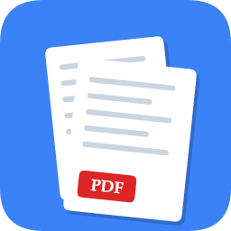
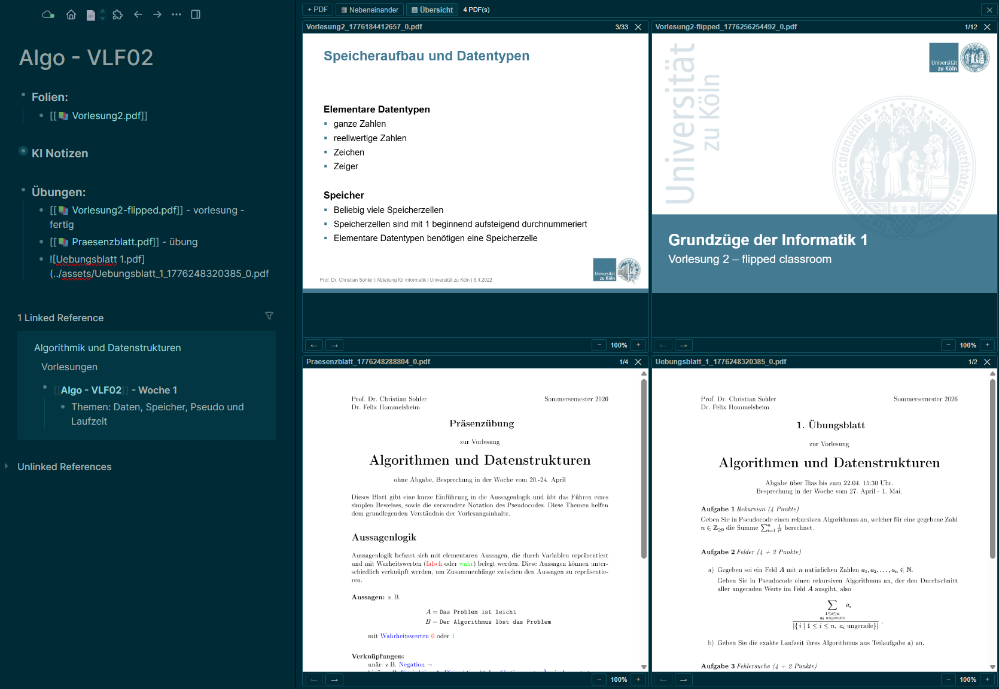

<p align="center">
  
</p>

<h1 align="center">Multi PDF Viewer for Logseq</h1>

<p align="center">View multiple PDFs side-by-side directly inside Logseq.</p>



## Features

- **Side-by-side PDFs** — open any number of PDFs (up to a configurable limit) next to each other
- **Two layouts** — horizontal scroll or a dynamic grid (Übersicht)
- **Open from blocks** — point at a block containing a PDF link and open it with one command
- **Resizable panel** — drag the left edge to change the viewer width; the size is remembered
- **Theme-aware** — picks up Logseq's current light/dark theme (and custom themes) automatically
- **Page navigation** — previous / next page per PDF

## Installation

### From the Logseq Marketplace

*(Coming soon — pending marketplace submission.)*

### Manual (unpacked)

1. Download the latest release ZIP from the [Releases page](https://github.com/lenn07/multi-pdf-viewer-logseq/releases).
2. Extract it somewhere on your disk.
3. In Logseq: `Settings → Plugins → Load unpacked plugin` and select the extracted folder.

## Usage

- **Toolbar button** — click the 📄 icon in the Logseq toolbar to open the viewer.
- **Command palette**:
  - `PDF Viewer öffnen` — opens the empty viewer panel.
  - `PDF aus Block im Viewer öffnen` — reads the currently selected block, finds a Markdown PDF link like `[label](../assets/file.pdf)` and opens it in the viewer.
- **Inside the viewer**:
  - `+ PDF` — same as the block command above.
  - `▦ Nebeneinander` / `▤ Übersicht` — switch between layouts.
  - Drag the left edge of the panel to resize.

## Settings

- **Maximale Anzahl PDFs** (`maxViewer`, default: `4`) — how many PDFs can be open at once. When the limit is reached, the oldest PDF rotates out.

## Development

```bash
npm install          # install dependencies
npm run dev          # start Vite dev server (port 3000)
npm run build        # build for production (output: dist/)
```

After each build, reload the plugin in Logseq (`Plugins → reload`).

## Tech stack

- React 18 + Vite
- PDF.js (legacy build — required for Logseq's Electron runtime)
- Logseq Plugin API

## License

[MIT](LICENSE) © lenn07
